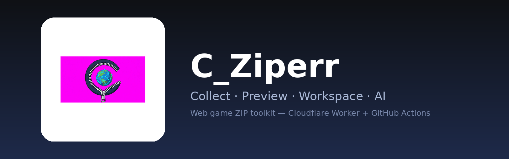

<p align="center"></p>

<p align="center">


</p>

# C_Ziperr

Toolkit untuk **mengumpulkan**, **menjalankan**, dan **mengedit** ZIP game web — lengkap dengan editor ala VS Code dan bantuan AI. Semuanya berjalan di browser (termasuk HP), dengan Cloudflare Worker + GitHub Actions di belakangnya.

**Tahap 0–4 selesai:** tersedia core collector bersama, local Playwright collector, laporan CDN, SQLite job history/checkpoint, dan IndexedDB adapter browser. Worker lama tetap dipertahankan sebagai adapter deployment.

## Fitur

| Menu | Fungsi |
|---|---|
| **1 Collect** | Masukkan URL → job GitHub Actions (Playwright) → unduh otomatis → dialog error + kartu kelengkapan 6 lapisan |
| **2 Preview** | Jalankan ZIP dari memori (Service Worker) · log 404 & error runtime · 🔧 Perbaiki otomatis · 🤖 Perbaiki dengan AI |
| **3 Workspace** | Editor ala VS Code (syntax highlight, Ctrl+P, cari/ganti global) · Custom API · Deteksi Workers · 🤖 Chat AI |
| **4 🔑 Setelan** | API AI (Anthropic / OpenAI-compatible), token akses Worker, ganti domain API di ZIP |

**Enam lapisan yang dikumpulkan:** HTML · JavaScript/CSS · Asset (gambar, sprite/atlas, SVG, font, audio, video, 3D/wasm) · Data (JSON, config, manifest, localization) · CDN (domain lain) · Server/API (login, state, balance, spin/action, response).

## Arsitektur

```
Browser (public/) ─POST /api/collect─▶ Worker ─dispatch─▶ GitHub Actions (Playwright)
      ▲   ▲                              │                        │
      │   └──── /api/status ─────────────┤                        │
      └──────── /api/download ◀──────────┴──────── artifact ◀─────┘
```

## Mulai cepat

**A. Lengkap (Worker + Actions)**
```bash
npm i
npx wrangler secret put GH_TOKEN       # token GitHub, izin Actions: read & write
npx wrangler secret put ACCESS_TOKEN   # opsional, disarankan
npm run deploy
```
Ubah `GH_REPO` / `GH_REF` di `wrangler.toml`, buka URL `*.workers.dev`, lalu isi 🔑 Setelan.

**B. Hanya GitHub (tanpa Worker)**
1. Repo → **Actions → collect → Run workflow** (isi link game, spin, detik).
2. Unduh artifact ZIP dari halaman run.
3. Buka UI → **Workspace** → muat ZIP → Preview / Editor / Chat AI.

UI bisa dihosting di GitHub Pages (`.github/workflows/pages.yml`). **Catatan:** Preview butuh origin di root domain, jadi gunakan repo `<user>.github.io` atau domain kustom; di subpath `/<repo>/` Preview tidak berfungsi. Tombol Collect tetap butuh Worker.

**C. Local collector (Tahap 2)**

```bash
npm install
npx playwright install chromium
npm run collect:local -- https://game.example --out out/game-1 --play-seconds 30 --spins 4
```

CLI lokal memakai core engine yang sama dengan GitHub Actions dan membuat ZIP plus laporan `cdn-manifest.json`, `cdn-missing.json`, dan `cdn-domains.json`. Job, checkpoint, event, artifact, dan SHA-256 dicatat di SQLite; metadata browser memakai IndexedDB.

## Konfigurasi

| Nama | Lokasi | Fungsi |
|---|---|---|
| `GH_TOKEN` | Worker secret | Memicu workflow & mengunduh artifact |
| `ACCESS_TOKEN` | Worker secret (opsional) | Melindungi `/api/*` (header `x-token`) |
| `GH_REPO`, `GH_REF` | `wrangler.toml` | Repo dan branch workflow |
| `COLLECT_COOKIES` | GitHub secret (opsional) | Cookie sesi saat collect (`a=b; c=d` atau JSON Playwright) |

Input workflow `collect`: `game_url`, `folder`, `play_seconds`, `spins`, `spin_x`, `spin_y`, `har`.

## Hasil collect

```
assets/<host>/...   server/0001.json ...    index.rendered.html
kelengkapan.json    keterangan.json        KETERANGAN.md
cdn-manifest.json   cdn-missing.json        cdn-domains.json
traffic.har         (opsional jika HAR=1)
```

## Aplikasi (APK)

Logo C_Ziperr adalah ikon utama (`public/icon-*.png`, `manifest.webmanifest`). Panduan membuat APK: [`docs/APK.md`](docs/APK.md).

## Status & batasan

Tahap 0–4 lolos syntax check, unit test, dan audit dependency production. End-to-end browser/game nyata tetap perlu dijalankan pada URL yang Anda miliki/izinkan; game dengan anti-bot, WebSocket-only, atau login rumit tidak sepenuhnya terekam. Detail implementasi: [`docs/STAGES-0-4.md`](docs/STAGES-0-4.md). Checklist existing dan batasan lain: [`docs/CATATAN.md`](docs/CATATAN.md).

## Penggunaan yang bertanggung jawab

Gunakan hanya untuk game milikmu atau yang izinnya jelas (hak cipta dan ToS). Alat ini **tidak** menyertakan pengatur RNG/hasil spin maupun pemalsuan ID/sesi; editor aturan API ditujukan untuk QA dan demo offline.

## Lisensi

Belum ditentukan — tambahkan `LICENSE` sesuai pilihanmu sebelum dipublikasikan.
