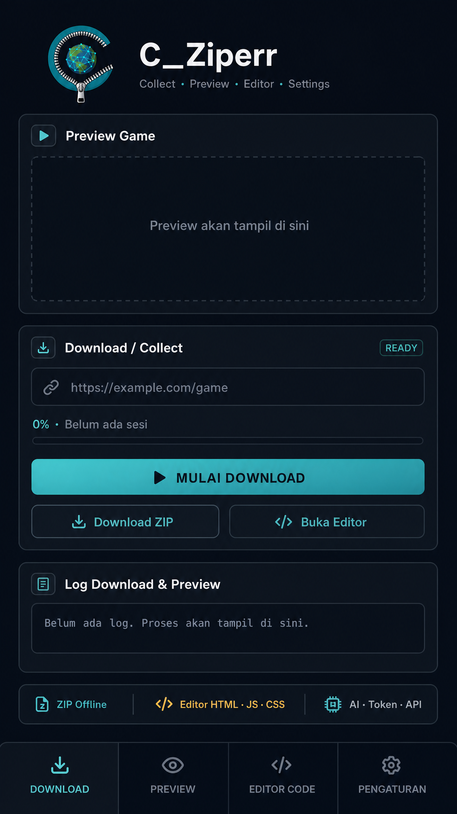

# C_Ziperr — Catatan Proyek (v3)

Alat untuk **mengumpulkan (collect)**, **menjalankan (preview)**, dan **mengedit (workspace)** ZIP game web, dengan bantuan AI. Berjalan di Cloudflare Worker + GitHub Actions (Playwright).

## Visual rancangan APK

Tampilan mobile menggunakan gaya profesional dark navy dengan aksen cyan-teal. Empat fitur utama yang ditampilkan adalah **Download**, **Preview**, **Editor Code**, dan **Pengaturan**.



---

## 1. Arsitektur

```
Browser (public/)  ──POST /api/collect──▶  Worker  ──dispatch──▶  GitHub Actions
   ▲   ▲                                     │                      (Playwright)
   │   └──── /api/status (polling) ──────────┤                          │
   └──────── /api/download (stream ZIP) ◀────┴──────── artifact ◀───────┘
```

| Bagian | File | Tugas |
|---|---|---|
| UI | `public/index.html` | 4 menu + Setelan, Download, Workspace, log |
| Editor | `public/editor.js` | Editor ala VS Code (CodeMirror 5) |
| Preview | `public/preview.js`, `public/__game/sw.js` | Menjalankan game dari memori via Service Worker |
| Tambahan | `public/extra.js` | Kelengkapan 6 lapisan, Setelan AI, Chat AI, perbaikan preview |
| Worker | `worker/src/index.js` | Dispatch job, status, stream artifact, token akses, rate limit |
| Collector | `tools/collect.mjs` | Membuka game, bermain, merekam semua resource dan API |
| Workflow | `.github/workflows/collect-production.yml` | Menjalankan collector, mengunggah artifact |
| PWA | `manifest.webmanifest`, `icon-*.png`, `logo.png` | Logo utama dan ikon aplikasi |

---

## 2. Menu 1 — Collect

**Alur:** isi link game → Mulai → Worker kirim job → polling status → unduh ZIP → dimuat ke workspace.

Parameter: link, folder, jumlah spin (maks 500), lama bermain (maks 600 dtk), koordinat tombol spin (opsional), HAR (0/1).

### Enam lapisan yang dikumpulkan

```
GAME WEB
├── 1. HTML          index.html + index.rendered.html (hasil render)
├── 2. JavaScript    game.js, engine.js, library/dependencies, CSS, .map
├── 3. Asset         PNG/JPG/WebP, sprite/atlas, SVG, font, audio, video, 3D/wasm/bin
├── 4. Data          JSON, config, manifest, localization
├── 5. CDN           semua resource dari domain lain (assets/<domain>/...)
└── 6. Server/API    login, game state, balance, spin/action, response → server/NNNN.json
```

- **Auto download:** artifact diunduh otomatis setelah job sukses.
- **Crawl referensi:** membaca isi JS/HTML/data lalu mengambil file yang disebut tapi belum termuat (bahasa lain, chunk, bonus).
- **Kelengkapan:** kartu ✅/⚠️ per lapisan + hitungan API (login/state/balance/spin/lain).
- **Dialog error:** error asli (download, file gagal) muncul di dialog. Tebakan crawl 404 dipisah agar tidak mengganggu.
- **Cookie (opsional):** secret repo `COLLECT_COOKIES` (`a=b; c=d` atau JSON Playwright).

Hasil ZIP:

```
assets/<host>/...    server/0001.json ...    index.rendered.html
kelengkapan.json     keterangan.json         KETERANGAN.md     (traffic.har jika HAR=1)
```

---

## 3. Menu 2 — Preview

- Game dijalankan **dari isi ZIP di memori** (Service Worker scope `/__game/`), butuh HTTPS.
- Mode tampilan: Mobile / Tablet / Desktop.
- **Request tidak ditemukan (404)** dicatat dan ditampilkan.
- **Error runtime** (error JS, promise rejection) ditangkap dari dalam game dan ditampilkan.
- **🔧 Perbaiki otomatis:** membuat alias untuk file 404 dari file sejenis di ZIP (cocok nama + akhiran path), menambah stub API `{}` untuk endpoint tanpa file, lalu menjalankan ulang.
- **🤖 Perbaiki dengan AI:** mengirim error, 404, daftar file, dan awal entry ke AI. Hasil (edit + aturan API) diterapkan setelah konfirmasi, lalu preview dijalankan ulang.
- Dukungan Range request untuk audio/video.

---

## 4. Menu 3 — Workspace (ala VS Code)

**Tab File:** muat ZIP, cari file, daftar per jenis, ganti teks di semua file kode.

**Editor:** explorer + filter, tab dengan penanda belum tersimpan (●), quick open `Ctrl+P`, cari di semua file `Ctrl+Shift+F`, replace `Ctrl+H`, lompat baris `Ctrl+G`, komentar `Ctrl+/`, syntax highlight (JS, JSON, CSS, HTML, XML), fold, auto-close bracket, format JSON, wrap, ukuran font, status bar, file baru / ganti nama / hapus, pratinjau gambar dan audio.

**Tab Custom API:**
- Aturan terisi otomatis dari `server/*.json`, diberi label jenis (login/state/balance/spin/lain).
- Edit `match`, status, body; tambah/hapus aturan.
- Syarat opsional **"hanya jika body request berisi…"**; aturan bersyarat diprioritaskan.
- "Set nilai field" ke semua respons (mis. `balance`) untuk demo/QA offline.
- Export `mock-api.json`; ikut terbaca lagi saat ZIP dimuat.

**Tab Deteksi Workers:** memindai Web Worker, Service Worker, WebAssembly, WebSocket, Cloudflare Workers/Pages, Workers AI, API LLM, fetch/XHR, plus daftar domain eksternal.

**Tab 🤖 Chat AI:** AI menerima daftar file dan file yang sedang terbuka; jawaban dengan blok JSON `edits` bisa diterapkan lewat "Terapkan edit terakhir".

Export ZIP menyimpan semua edit terlebih dulu, lalu menambahkan `mock-api.json`.

---

## 5. Menu 4 — Setelan (ikon 🔑)

- Penyedia AI: **Anthropic** atau **OpenAI-compatible** (base URL, model, API key).
- Token akses Worker (opsional).
- **Terapkan ke ZIP:** ganti domain/URL API lama → endpoint baru di semua file kode dan aturan API.
- Semua nilai disimpan di `localStorage` browser ini dan dikirim langsung ke penyedia AI. Jangan dipakai di perangkat bersama.

---

## 6. Ringkasan bug yang sudah diperbaiki

| # | Bug | Status |
|---|---|---|
| 1 | ID `#sb` dobel (sidebar editor vs tombol Terapkan API) | ✅ |
| 2 | "Coba lagi" menghapus workspace | ✅ hanya untuk error download/lanjut |
| 3 | Export/Ganti teks kehilangan edit belum tersimpan | ✅ |
| 4 | `mock-api.json` tidak terbaca saat impor | ✅ |
| 5 | Endpoint Worker tanpa autentikasi | ✅ token `ACCESS_TOKEN` + rate limit 5 job/10 menit/IP (per instance) |
| 6 | Respons API biner rusak | ✅ tambahan `response_b64` |
| 7 | Path traversal di `filePath` | ✅ |
| 8 | Artifact tidak diunggah saat job gagal | ✅ `if: always()` |
| 9 | Range request audio/video | ✅ |
| 10 | Polling tanpa timeout | ✅ 1900 dtk |
| 11 | Dialog gagal penuh tebakan crawl | ✅ dipisah |
| 12 | Playwright diunduh ulang tiap run | ✅ cache |

---

## 7. Deploy

1. Push repo ke GitHub; sesuaikan `GH_REPO` dan `GH_REF` di `wrangler.toml`.
2. Buat token GitHub (fine-grained) dengan izin **Actions: read & write** pada repo tersebut.
3. `npm i`, lalu:
   ```
   npx wrangler secret put GH_TOKEN
   npx wrangler secret put ACCESS_TOKEN     # opsional tapi disarankan
   npm run deploy
   ```
4. (Opsional) GitHub → Settings → Secrets → Actions → `COLLECT_COOKIES`.
5. Buka URL `*.workers.dev` (HTTPS), masuk ke 🔑, isi API key AI dan token akses.
6. GitHub Pages: Preview hanya berfungsi di root domain (`<user>.github.io` atau domain kustom), bukan subpath repo.
7. Untuk APK: bungkus URL yang sama dengan PWABuilder atau Bubblewrap; `manifest.webmanifest` dan ikon sudah siap.

---

## 8. Batasan yang perlu diketahui

- Collector adalah Chromium headless: game dengan anti-bot, login rumit, atau WebSocket-only tidak sepenuhnya terekam.
- Artifact GitHub disimpan 30 hari; ZIP besar dimuat ke memori browser.
- Rate limit Worker bersifat best-effort (tanpa penyimpanan bersama).
- Error yang terjadi sebelum hook terpasang di halaman tidak tertangkap.
- Perbaikan AI bergantung pada kualitas model dan konteks yang dikirim; selalu tinjau hasilnya.
- Belum ada: penangkapan WebSocket, penampil HAR, skrip login terpandu, diff view, dan multi-job paralel (calon pengembangan).

## 9. Di luar cakupan

Tidak disertakan: pengatur RNG/hasil spin dan penggantian ID/sesi. Fitur semacam itu hanya berguna untuk memanipulasi klon game terhadap pemain sungguhan. Editor aturan API dan "Set nilai field" tetap tersedia untuk QA dan demo offline. Pastikan hanya mengumpulkan game milikmu atau yang izinnya jelas (hak cipta dan ToS).

## 10. Daftar uji cepat

- [ ] Collect URL contoh → status berjalan → ZIP terunduh otomatis
- [ ] Kartu Kelengkapan menampilkan 6 lapisan
- [ ] Preview berjalan (HTTPS); 404/error tampil; Perbaiki otomatis bekerja
- [ ] Editor: edit file → Simpan → Export ZIP → muat ulang, edit tetap ada
- [ ] Custom API: aturan dengan syarat body cocok hanya untuk request yang sesuai
- [ ] 🔑 Tes AI → "OK"; Chat AI dan Perbaiki dengan AI menghasilkan edit
- [ ] Token akses salah → 401; lebih dari 5 job/10 menit → 429

---

## 11. Implementasi Tahap 5–9

- **Local HTTP Preview Server:** `core/server/preview.mjs`, bind default `127.0.0.1`, CSP, MIME, root/symlink isolation, dan path traversal protection.
- **Local API/Mock Server:** `core/server/mock-api.mjs`, membaca `server/*.json` serta `mock-api.json`, dengan method/path/body match, delay, status, response, log, dan health.
- **Path Rewriter:** `core/repair/rewriter.mjs`, menghasilkan `rewrite-report.json`.
- **Dependency/Asset Scanner:** `core/analyze/dependencies.mjs`, menghasilkan hash, ukuran, tipe, dependency edges, external URL, runtime feature, serta duplicate report.
- **Offline Validation:** `core/offline/validator.mjs`, menghasilkan `offline-readiness.json` dengan `FULL_OFFLINE_READY`, `PARTIAL`, atau `NOT_READY`.

Command lokal:

```bash
npm run preview:local -- ./out/game-1
npm run mock:local -- ./out/game-1
npm run rewrite:package -- ./out/game-1 OLD_URL http://127.0.0.1:4000
npm run scan:package -- ./out/game-1
npm run validate:offline -- ./out/game-1
```

Status `PARTIAL` atau `NOT_READY` harus dianggap belum offline penuh; laporan menjelaskan resource hilang, URL eksternal, API tanpa mock, dan warning yang harus diperbaiki.


---

## 12. Implementasi Tahap 10–13

- UI asli tetap memakai `loadZip()` yang sama untuk demo, endpoint Worker lama, `github`, dan `local`.
- `public/collect-adapters.js` menambahkan dispatch/poll/download GitHub Actions langsung dari browser.
- `tools/collect-bridge.mjs` menyediakan bridge lokal `127.0.0.1:8788/api` untuk Playwright local collector.
- `core/github/adapter.mjs` dan `tests/stages-10-13.test.mjs` memvalidasi kontrak adapter tanpa token nyata.
- `.github/workflows/release-apk.yml` menyiapkan TWA APK/AAB dari URL PWA HTTPS melalui Bubblewrap.

Untuk GitHub-only, pengguna harus mengisi owner, repository, ref, dan fine-grained token Actions read/write pada Setelan. Token disimpan di localStorage browser dan tidak ditanam di source atau workflow.
